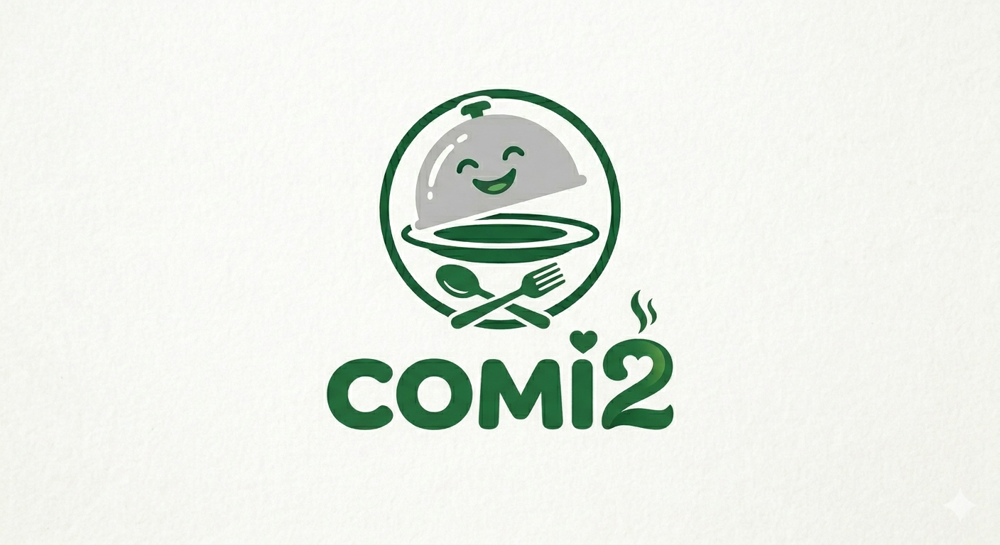
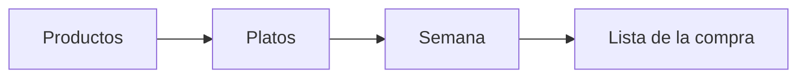

# Comi2



**Comi2** es una aplicación web sencilla para organizar **qué comer cada día de la semana** y sacar una **lista de la compra** con lo que necesitas. Pensada para el día a día en casa: tus platos, tus productos, tu menú.

> **Proyecto personal · hecho con IA y vibecoding**  
> Este repositorio nació como una herramienta para uso propio. El código y la documentación se han ido construyendo con ayuda de **inteligencia artificial** y **vibecoding** (iterar en conversación con el asistente, probar en el navegador, ajustar). No es un producto comercial ni un servicio con soporte: si te sirve, adelante; si encuentras algo raro, es normal en un proyecto así.

---

## ¿Para qué sirve?

1. Guardas **productos** (ingredientes, con emoji si quieres).
2. Creas **platos** con esos productos, si son de comida, cena o ambos, y etiquetas de color.
3. En **Semana** asignas un plato a cada comida y cena (lunes a domingo). Puedes usar **Limpiar semana** para vaciar el plan de golpe (tras confirmar).
4. En **Lista** generas la compra: productos únicos de los platos planificados; puedes tachar lo que ya tienes en casa. La lista **se mantiene al cambiar de sección** hasta que pulses **Generar lista** de nuevo o **Borrar lista**.

Todo se guarda **en tu navegador** (sin cuenta ni servidor). Si borras los datos del sitio, pierdes el contenido.

**Copia de seguridad:** en **Platos**, al final de la página, la sección **Respaldo** permite **exportar** un archivo JSON con productos, platos, etiquetas y semana planificada, o **importarlo** en esta u otra instalación de Comi2. La importación **sustituye por completo** los datos que hubiera en ese dispositivo.



---

## Probar la app en tu ordenador (solo web)

**No hace falta Android ni APK** para usar Comi2: con el navegador basta.

Necesitas [Node.js](https://nodejs.org/) LTS (v20 o superior).

La primera vez instala dependencias dentro de **`app/`**:

```bash
cd app
npm install
```

**Arranque del servidor de desarrollo** (elige una opción):

```bash
# Desde la carpeta app (siempre válido)
npm run dev
```

```bash
# Desde la raíz del repositorio (hay un package.json que delega en app/)
npm run dev
```

Abre la URL que muestre la terminal (suele ser `http://localhost:5173`).

**Primer paseo:** crea un plato → rellena la semana → genera la lista. Los productos también puedes crearlos al editar un plato.

La **APK Android** es un paso **aparte y opcional**: solo quien quiera instalar la app en el móvil necesita JDK y Android SDK. Toda la guía está en **[docs/guias/android-apk.md](docs/guias/android-apk.md)** para no mezclar requisitos con quien solo desarrolla en local.

---

## App Android (APK, opcional)

Comi2 se puede instalar en el móvil como **APK** gracias a [Capacitor](https://capacitorjs.com/): la misma app web va dentro de una WebView; los datos siguen en **IndexedDB** en el dispositivo.

**Requisitos adicionales** (solo para este apartado): **JDK 21**, **Android SDK** (p. ej. con Android Studio), además de Node como en la sección anterior.

```bash
cd app
npm install
# Una vez: copia android/local.properties.example → android/local.properties y pon tu sdk.dir
npm run cap:apk:debug
```

La APK queda en:

- **`releases/comi2.apk`** (copia fácil de encontrar en la raíz del repo)
- `app/android/app/build/outputs/apk/debug/app-debug.apk` (salida de Gradle; carpeta ignorada por git)

Pasos completos, requisitos, solución de problemas y lista de cambios en el repo: **[docs/guias/android-apk.md](docs/guias/android-apk.md)**.

---

## Si quieres profundizar

| Quiero… | Dónde mirar |
|--------|-------------|
| Entender el proyecto de punta a punta | **[howto-comi2.md](howto-comi2.md)** — guía principal |
| Generar la APK Android | **[docs/guias/android-apk.md](docs/guias/android-apk.md)** |
| Requisitos y funcionalidades | [docs/](docs/) |
| Colores, logo y cabecera | [docs/branding/branding.md](docs/branding/branding.md) |
| Código de la app | carpeta [`app/`](app/) (React + Vite + TypeScript + Dexie + Capacitor) |

### Rutas de la app

| Ruta | Qué es |
|------|--------|
| `/platos` | Tu recetario (pestañas, lista de platos y **Respaldo** JSON al final) |
| `/platos/:id` | Vista de un plato (desde la lista); **Editar plato** lleva al formulario |
| `/platos/:id/editar` | Formulario para cambiar ese plato |
| `/platos/nuevo` | Crear un plato nuevo |
| `/productos` | Ingredientes |
| `/semana` | Planificador de la semana |
| `/lista` | Lista de la compra |

---

## Cómo está hecho (resumen)

| Parte | Tecnología |
|-------|------------|
| Interfaz | React, TypeScript |
| Navegación | React Router |
| Build | Vite |
| Datos en el navegador / móvil | Dexie (IndexedDB), base `comi2-db` |
| APK Android | Capacitor 8 (`es.comi2.app`) |

Comandos útiles: desde **`app/`**, `npm run dev`, `npm run build`, `npm run lint`; desde la **raíz del repo**, los mismos atajos (`npm run dev`, etc.) llaman a `app/` vía `npm --prefix`. Para APK: `npm run cap:apk:debug` **solo dentro de `app/`** (ver guía Android).

---

## Estructura del repo

```
Comi2/
├── README.md         ← estás aquí
├── package.json      ← atajos npm en la raíz (delegan en app/)
├── howto-comi2.md    ← documentación detallada
├── releases/         ← copia de la APK de prueba (comi2.apk); no versionada en git
├── docs/             ← requisitos, arquitectura, branding, guía APK…
├── assets/           ← logos e imágenes (logo2, comi2…)
└── app/              ← código y npm principal (web + proyecto Android en app/android/)
```

---

## Licencia y uso

Uso **personal**. Puedes inspirarte en el código o forkarlo para ti, pero no hay garantías. La marca y los assets en `assets/imagenes/` son parte de este proyecto concreto.

Si tienes curiosidad por el proceso (IA, decisiones, MVP), la [howto](howto-comi2.md) y los docs en `docs/` cuentan el resto con más detalle técnico.
