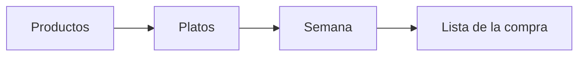

# Comi2

**Comi2** es una aplicación web sencilla para organizar **qué comer cada día de la semana** y sacar una **lista de la compra** con lo que necesitas. Pensada para el día a día en casa: tus platos, tus productos, tu menú.

> **Proyecto personal · hecho con IA y vibecoding**  
> Este repositorio nació como una herramienta para uso propio. El código y la documentación se han ido construyendo con ayuda de **inteligencia artificial** y **vibecoding** (iterar en conversación con el asistente, probar en el navegador, ajustar). No es un producto comercial ni un servicio con soporte: si te sirve, adelante; si encuentras algo raro, es normal en un proyecto así.

---

## ¿Para qué sirve?

1. Guardas **productos** (ingredientes, con emoji si quieres).
2. Creas **platos** con esos productos, si son de comida, cena o ambos, y etiquetas de color.
3. En **Semana** asignas un plato a cada comida y cena (lunes a domingo).
4. En **Lista** generas la compra: productos únicos de los platos planificados; puedes tachar lo que ya tienes en casa.

Todo se guarda **en tu navegador** (sin cuenta ni servidor). Si borras los datos del sitio, pierdes el contenido.



---

## Probar la app en tu ordenador

Necesitas [Node.js](https://nodejs.org/) LTS (v20 o superior).

```bash
cd app
npm install
npm run dev
```

Abre la URL que muestre la terminal (suele ser `http://localhost:5173`).

**Primer paseo:** crea un plato → rellena la semana → genera la lista. Los productos también puedes crearlos al editar un plato.

---

## Si quieres profundizar

| Quiero… | Dónde mirar |
|--------|-------------|
| Entender el proyecto de punta a punta | **[howto-comi2.md](howto-comi2.md)** — guía principal |
| Requisitos y funcionalidades | [docs/](docs/) |
| Colores, logo y cabecera | [docs/branding/branding.md](docs/branding/branding.md) |
| Código de la app | carpeta [`app/`](app/) (React + Vite + TypeScript + Dexie) |

### Rutas de la app

| Ruta | Qué es |
|------|--------|
| `/platos` | Tu recetario (por listado, momento o etiquetas) |
| `/productos` | Ingredientes |
| `/semana` | Planificador de la semana |
| `/lista` | Lista de la compra |

---

## Cómo está hecho (resumen)

| Parte | Tecnología |
|-------|------------|
| Interfaz | React, TypeScript |
| Navegación | React Router |
| Build | Vite |
| Datos en el navegador | Dexie (IndexedDB), base `comi2-db` |

Comandos útiles dentro de `app/`: `npm run dev`, `npm run build`, `npm run lint`.

---

## Estructura del repo

```
Comi2/
├── README.md         ← estás aquí
├── howto-comi2.md    ← documentación detallada
├── docs/             ← requisitos, arquitectura, branding…
├── assets/           ← logos e imágenes (logo2, comi2…)
└── app/              ← código de la aplicación
```

---

## Licencia y uso

Uso **personal**. Puedes inspirarte en el código o forkarlo para ti, pero no hay garantías. La marca y los assets en `assets/imagenes/` son parte de este proyecto concreto.

Si tienes curiosidad por el proceso (IA, decisiones, MVP), la [howto](howto-comi2.md) y los docs en `docs/` cuentan el resto con más detalle técnico.
