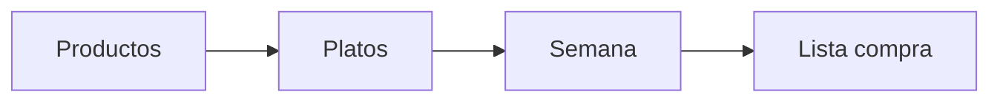

# Comi2

Aplicación web para **planificar comidas y cenas de la semana** (lunes a domingo) y **generar la lista de la compra** a partir de los platos que elijas.

Funciona **sin servidor**: todos los datos se guardan en el navegador (IndexedDB) con [Dexie.js](https://dexie.org/).

## Qué puedes hacer

- Gestionar un catálogo de **productos** (ingredientes).
- Crear **platos** con sus productos, momento del día (**comida**, **cena** o **ambos**) y **etiquetas con color**.
- Planificar la **semana**: un plato por comida y otro por cena cada día (14 huecos).
- **Generar la lista de la compra** con los productos únicos de los platos planificados.



## Inicio rápido

Requisitos: [Node.js](https://nodejs.org/) LTS (v20+).

```bash
cd app
npm install
npm run dev
```

Abre `http://localhost:5173` (o la URL que indique Vite).

**Primer uso:** Nuevo plato → Semana → Generar lista. (Los productos se pueden crear también al editar un plato.)

## Pantallas

| Ruta | Descripción |
|------|-------------|
| `/platos` | Catálogo agrupado por momento o por etiquetas (subsecciones colapsables) |
| `/productos` | Ingredientes |
| `/platos/nuevo`, `/platos/:id` | Crear o editar plato (etiquetas, productos) |
| `/semana` | Planificador semanal |
| `/lista` | Lista de la compra |

## Estructura del repositorio

```
Comi2/
├── howto-comi2.md    # Guía completa del proyecto
├── docs/             # Requisitos, funcionalidades, arquitectura
├── assets/           # Diseños e imágenes
└── app/              # React + Vite + TypeScript + Dexie
```

## Stack

| Capa | Tecnología |
|------|------------|
| UI | React 19, TypeScript |
| Enrutado | React Router |
| Build | Vite |
| Datos locales | Dexie → IndexedDB (`comi2-db`) |

## Scripts (`app/`)

| Comando | Descripción |
|---------|-------------|
| `npm run dev` | Desarrollo |
| `npm run build` | Build de producción |
| `npm run preview` | Vista previa del build |
| `npm run lint` | ESLint |

## Documentación

**Empieza aquí:** [howto-comi2.md](howto-comi2.md) — producto, uso, base de datos, código fuente y flujos.

| Documento | Contenido |
|-----------|-----------|
| [docs/README.md](docs/README.md) | Índice de documentación |
| [docs/requisitos/requisitos.md](docs/requisitos/requisitos.md) | Requisitos funcionales y no funcionales |
| [docs/funcionalidades/funcionalidades.md](docs/funcionalidades/funcionalidades.md) | Módulos y criterios de aceptación |
| [docs/arquitectura/arquitectura.md](docs/arquitectura/arquitectura.md) | Modelo de datos y decisiones técnicas |
| [docs/branding/branding.md](docs/branding/branding.md) | Identidad visual, colores pastel, UI |
| [docs/guias/desarrollo.md](docs/guias/desarrollo.md) | Guía breve para desarrolladores |

## Assets de diseño

Mockups e imágenes en [`assets/`](assets/) (`disenos/`, `imagenes/`). Ver [assets/README.md](assets/README.md).
