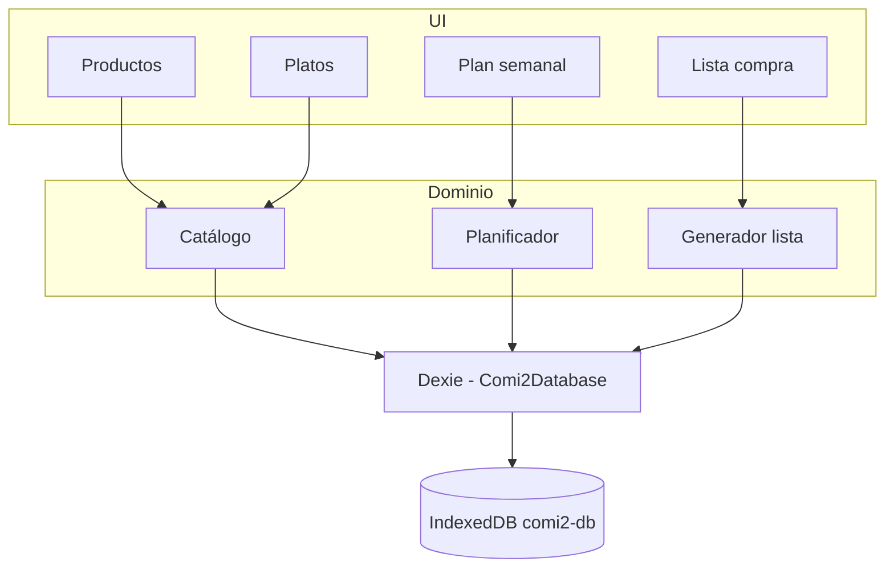
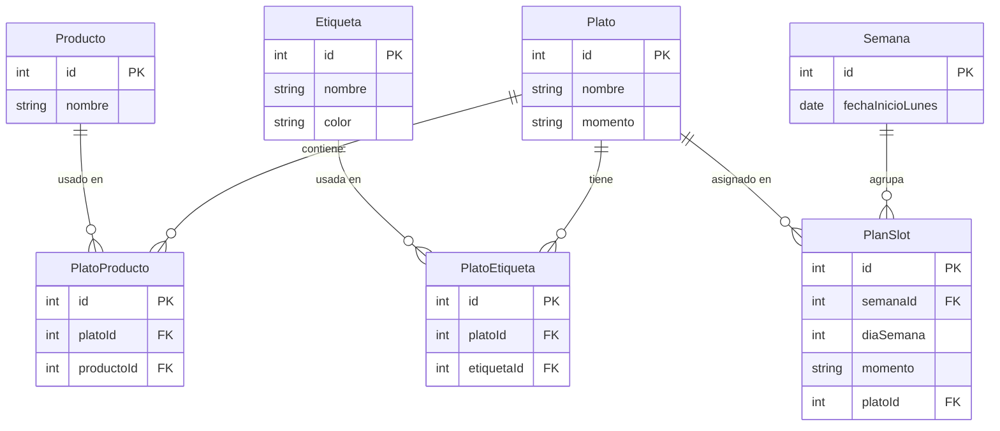

# Arquitectura — Comi2

## Stack

| Capa | Tecnología |
|------|------------|
| UI | React + TypeScript |
| Build | Vite |
| Estado / datos locales | Dexie.js (IndexedDB) |
| Estilos | CSS (por ampliar) |

## Estructura del repositorio

```
Comi2/
├── docs/       # Documentación
├── assets/     # Diseños e imágenes
└── app/        # Código fuente (React)
```

## Capas de la aplicación



## Modelo de datos

Base de datos: `comi2-db` (IndexedDB en el navegador).

### Diagrama entidad-relación



**`momento` (Plato):** `comida` | `cena` | `ambos` — determina en qué huecos del planificador puede asignarse el plato (no confundir con etiquetas libres).

**`Etiqueta`:** nombre único + **`color`** (hex, ej. `#4CAF50`). Catálogo global; se crea y edita desde la pantalla de edición del plato. Relación N:M con `Plato` vía `platoEtiquetas`. En UI: chips con el color asignado.

**`momento` (PlanSlot):** `comida` | `cena`

**`diaSemana`:** `0` = lunes … `6` = domingo

**`fechaInicioLunes`:** fecha del lunes de la semana planificada (semana activa en el MVP).

### Tablas Dexie (versión 2 — planificada)

| Tabla | Índices | Descripción |
|-------|---------|-------------|
| `productos` | `++id, nombre` | Ingredientes (`nombre`, `emoji`) |
| `platos` | `++id, nombre, momento` | Platos con momento comida/cena/ambos |
| `etiquetas` | `++id, nombre, color` | Catálogo de etiquetas (nombre único, color hex) |
| `platoEtiquetas` | `++id, platoId, etiquetaId, [platoId+etiquetaId]` | Etiquetas asignadas a cada plato |
| `platoProductos` | `++id, platoId, productoId` | Productos que lleva cada plato (sin cantidad) |
| `semanas` | `++id, fechaInicioLunes` | Semana planificada |
| `planSlots` | `++id, semanaId, [semanaId+diaSemana+momento]` | Un plato por hueco; único por semana+día+momento |

La **lista de la compra** se calcula en memoria (sin tabla en el MVP).

### Algoritmo: generar lista de la compra

1. Obtener `planSlots` de la semana activa con `platoId` definido (hasta 14).
2. Para cada `platoId`, cargar `platoProductos` y resolver `productoId` → nombre.
3. Unir todos los `productoId` en un `Set` (cada producto aparece una vez).
4. Ordenar por nombre y mostrar en la UI.

*Futuro:* añadir `cantidad` y `unidad` en `platoProductos` y sumar por producto al generar la lista.

## Migraciones Dexie

| Versión | Cambios |
|---------|---------|
| 1 | Tabla `items` de ejemplo (smoke test) |
| 2 | `productos`, `platos`, `etiquetas`, `platoEtiquetas`, `platoProductos`, `semanas`, `planSlots` |
| 3 | Campo `emoji` en `productos` (upgrade asigna emoji a filas existentes) |

Definición en [`app/src/db/database.ts`](../../app/src/db/database.ts). La tabla `items` (v1) quedó obsoleta.

## Decisiones técnicas

- **BD local en cliente:** sin servidor; datos por origen del navegador.
- **Lista derivada:** se genera al vuelo desde plan + platos; evita desincronización.
- **Unicidad de hueco:** índice compuesto en `planSlots` evita dos platos en el mismo día/momento.
- **Filtrado por momento:** en UI, `plato.momento` compatible con `planSlot.momento` (`ambos` vale para los dos).
- **Etiquetas:** varias por plato; gestión en vista edición plato (sin pantalla aparte obligatoria); `color` en hex; selector de color al crear/editar; contraste texto legible sobre el chip.

## Pantallas (MVP)

| Vista | Responsabilidad |
|-------|-----------------|
| Productos | CRUD productos |
| Productos / detalle | Emoji, nombre inline, platos que usan el producto |
| Platos / editar | Pestañas Todos/momento/etiquetas, acordeones con color, alta, edición, ingredientes |
| Semana | Grilla lunes–domingo × (comida, cena); selector filtrado por tipo |
| Lista | Generar y mostrar productos únicos (emoji + nombre por fila, alineación izquierda) |
