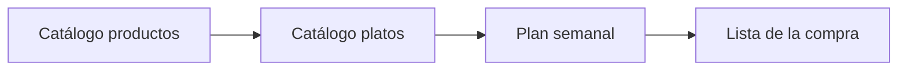

# Funcionalidades — Comi2

## Visión general

Comi2 es una aplicación para **organizar qué comer cada día de la semana** y **sacar de ahí la compra**.

Flujo principal:

1. El usuario crea **productos** (ingredientes con emoji).
2. Crea **platos**, les asigna **productos** y **etiquetas** (ej. vegetariano, rápido).
3. En el **planificador semanal**, elige platos para cada **comida** y **cena** de cada día.
4. Genera la **lista de la compra** sumando los productos de todos los platos planificados.

## MVP (versión mínima viable)

| Feature | Descripción | Estado |
|---------|-------------|--------|
| CRUD productos | Alta, listado, detalle, borrado | Hecho |
| Emoji por producto | Selector con buscador y rejilla; auto al crear | Hecho |
| CRUD platos | Alta, edición y listado de platos | Hecho |
| Etiquetas | CRUD de etiquetas y asignación de varias etiquetas por plato | Hecho |
| Ingredientes del plato | Añadir/quitar productos; alta inline desde edición del plato | Hecho |
| Listado platos agrupado | Todos (lista directa), por momento o por etiquetas; acordeones con color | Hecho |
| Plan semanal | Lunes–domingo; 1 plato/comida + 1 plato/cena por día | Hecho |
| Generar lista de la compra | Productos únicos; checkbox «ya en casa» | Hecho |
| Persistencia local | IndexedDB vía Dexie v3 | Hecho |
| Filtrar platos por etiqueta en Semana | Al asignar hueco | Pendiente |

## Funcionalidades futuras

| Feature | Descripción | Prioridad |
|---------|-------------|-----------|
| Persistir «ya en casa» entre sesiones | Recordar marcas en la lista | Baja |
| Copiar semana anterior | Plantilla de menú recurrente | Baja |
| Categorías de productos | Agrupar en la lista (fruta, carnicería…) | Baja |
| Desayuno u otras comidas | Ampliar más allá de comida/cena | Baja |
| Exportar lista | PDF o compartir texto | Baja |
| Varias semanas guardadas | Historial de planes | Baja |

## Módulos

### Módulo 1 — Catálogo de productos

Gestión del inventario de ingredientes reutilizables entre platos.

**Criterios de aceptación:**

- [x] Puedo crear un producto con nombre (recibe emoji automático).
- [x] En el detalle (`/productos/:id`), edito el **nombre** con el lápiz (inline, Enter guarda).
- [x] En el detalle, pulso el **emoji** y elijo otro en el panel (buscador + rejilla de sugerencias).
- [x] Puedo eliminar un producto si no está en ningún plato (o se avisa).
- [x] Puedo crear un producto al editar un plato (`InlineProductoAdd`) y asignarlo al plato al instante.
- [x] Al pulsar un producto en el listado, veo todos los **platos** que lo usan.

### Módulo 2 — Catálogo de platos

Cada plato agrupa los productos de su elaboración, tiene un **momento** (comida, cena o ambos) y puede llevar **varias etiquetas** libres.

La **alta** de un plato es la vista en **`/platos/nuevo`** (React Router no expone un `:id` en esa URL; debe comportarse como formulario vacío para crear).

**Criterios de aceptación:**

- [x] Puedo crear un plato con nombre y **momento**: comida, cena o ambos.
- [x] Puedo añadir y quitar productos del plato (catálogo, lista «En este plato», alta rápida).
- [x] Al **editar un plato**, puedo crear una etiqueta nueva (nombre + **color**) y asignarla al plato, desde un **modal** dedicado a gestionar etiquetas.
- [x] Puedo elegir etiquetas ya existentes del catálogo (chips clicables en el formulario principal).
- [x] Puedo cambiar el nombre o el color de una etiqueta existente desde el modal de gestión (aplica a todos los platos).
- [x] Puedo quitar una etiqueta del plato sin borrarla del catálogo.
- [x] Puedo eliminar una etiqueta del catálogo desde el modal de gestión (se desvincula de todos los platos).
- [x] Las etiquetas se muestran como **chips** con color en listado, edición y planificador.
- [x] Si un plato no tiene etiquetas, se muestra el chip **«Sin etiquetas»** en estado deshabilitado.
- [x] En **Platos**: pestaña **Todos** (lista directa); **Por momento** / **Por etiquetas** con acordeones colapsables y color.
- [ ] Puedo eliminar un plato desde el listado o la edición.

### Módulo 3 — Planificador semanal

Vista de la semana actual con huecos **Comida** y **Cena** por día.

**Criterios de aceptación:**

- [x] Veo la semana de **lunes a domingo** con dos huecos por día (comida, cena).
- [x] Puedo asignar **un plato** por hueco (o dejarlo vacío).
- [x] Solo se ofrecen platos cuyo **momento** coincide con el hueco (comida, cena o ambos).
- [x] Desde el desplegable de un hueco puedo elegir **«+ Nuevo plato…»** para crear un plato y que quede asignado automáticamente al volver a Semana.
- [x] Puedo ver un **resumen de solo lectura** de la semana (todos los días con comida y cena asignadas) desde un modal accesible con el botón **Ver resumen**.
- [ ] (Opcional MVP) Puedo filtrar platos por una o más etiquetas al asignar un hueco.

### Módulo 4 — Lista de la compra

Generación automática desde el plan de la semana activa.

**Criterios de aceptación:**

- [x] Al generar la lista, aparecen todos los productos de los platos planificados (emoji y nombre alineados a la izquierda en cada fila).
- [x] Si el mismo producto aparece en varios platos, aparece **una sola vez** (sin cantidades).
- [x] Puedo regenerar la lista si cambio el plan semanal.
- [x] Puedo marcar productos que **ya tengo en casa** con un checkbox para quitarlos de la lista principal.
- [x] Puedo recuperar un producto marcado desde **Ya en casa**.

## Flujos de usuario

### Flujo A — Configurar un plato nuevo

1. Ir a **Platos** → **Nuevo plato** (o elegir **«+ Nuevo plato…»** en un hueco de la semana).
2. Introducir nombre y **momento**.
3. Asignar etiquetas existentes (chips) o abrir **Gestionar etiquetas** para crear o editar etiquetas.
4. Añadir productos.
5. Guardar. Si venías desde Semana, el plato queda asignado en ese hueco y regresas a la vista semanal.

### Flujo A2 — Explorar platos

1. Ir a **Platos**.
2. Elegir **Todos**, **Por momento** o **Por etiquetas**.
3. En momento/etiquetas, abrir la subsección deseada.

### Flujo B — Planificar la semana

1. Ir a **Semana**.
2. Para cada día, elegir plato de **Comida** y **Cena** en el desplegable.
   - Si no existe el plato, elegir **«+ Nuevo plato…»** para crearlo y asignarlo al instante.
3. Los cambios se guardan automáticamente en local.
4. Pulsar **Ver resumen** para consultar la semana completa de un vistazo (solo lectura).
5. Opcional: **Limpiar semana** vacía todos los huecos.

### Flujo C — Hacer la compra

1. Ir a **Lista** → **Generar lista**.
2. Marcar con el checkbox lo que ya tienes en casa.
3. Comprar solo lo que queda en la lista principal.

### Flujo D — Gestionar un producto

1. Ir a **Productos** → pulsar un ingrediente.
2. Cambiar **emoji** o **nombre** (lápiz).
3. Revisar qué platos lo usan.

## Decisiones de producto (cerradas)

| Tema | Decisión |
|------|----------|
| Huecos por día | Un plato por comida + uno por cena |
| Cantidades | Solo nombres de producto; sin cantidades en el MVP |
| Momento del plato | Comida / cena / ambos; filtro en el planificador |
| Etiquetas | CRUD en edición del plato; nombre + color |
| Productos | Nombre + emoji; edición en pantalla de detalle |
| Listado de platos | Pestañas: Todos (ancho) / momento / etiquetas; acordeones con color |
| Navegación principal | Platos, Productos, Semana, Lista |
| Inicio de semana | Lunes |

## Notas

- Esquema Dexie **v3** (`productos.emoji`, migración automática).
- Detalle técnico: [arquitectura.md](../arquitectura/arquitectura.md).
