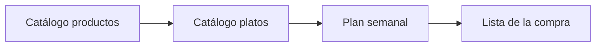

# Funcionalidades — Comi2

## Visión general

Comi2 es una aplicación para **organizar qué comer cada día de la semana** y **sacar de ahí la compra**.

Flujo principal:

1. El usuario crea **productos** (ingredientes).
2. Crea **platos**, les asigna **productos** y **etiquetas** (ej. vegetariano, rápido).
3. En el **planificador semanal**, elige platos para cada **comida** y **cena** de cada día.
4. Genera la **lista de la compra** sumando los productos de todos los platos planificados.

## MVP (versión mínima viable)

| Feature | Descripción | Estado |
|---------|-------------|--------|
| CRUD productos | Alta, listado y borrado de productos | Hecho |
| CRUD platos | Alta, edición y listado de platos | Hecho |
| Etiquetas | CRUD de etiquetas y asignación de varias etiquetas por plato | Hecho |
| Ingredientes del plato | Añadir/quitar productos; alta inline desde edición del plato | Hecho |
| Listado platos agrupado | Por momento o por etiquetas; subsecciones colapsables | Hecho |
| Plan semanal | Lunes–domingo; 1 plato/comida + 1 plato/cena por día | Hecho |
| Generar lista de la compra | Productos únicos de los platos planificados (sin cantidades) | Hecho |
| Persistencia local | Todo en IndexedDB vía Dexie v2 | Hecho |
| Marcar comprado en lista | Checkbox por línea | Pendiente |
| Filtrar platos por etiqueta en Semana | Al asignar hueco | Pendiente |

## Funcionalidades futuras

| Feature | Descripción | Prioridad |
|---------|-------------|-----------|
| Marcar productos comprados en la lista | Checkbox o estado por línea | Media |
| Copiar semana anterior | Plantilla de menú recurrente | Baja |
| Categorías de productos | Agrupar en la lista (fruta, carnicería…) | Baja |
| Desayuno u otras comidas | Ampliar más allá de comida/cena | Baja |
| Exportar lista | PDF o compartir texto | Baja |
| Varias semanas guardadas | Historial de planes | Baja |

## Módulos

### Módulo 1 — Catálogo de productos

Gestión del inventario de ingredientes reutilizables entre platos.

**Criterios de aceptación:**

- [x] Puedo crear un producto con nombre.
- [ ] Puedo editar un producto desde la pantalla Productos.
- [x] Puedo eliminar un producto si no está en ningún plato (o se avisa).
- [x] Puedo crear un producto al editar un plato (`InlineProductoAdd`) y asignarlo al plato al instante.

### Módulo 2 — Catálogo de platos

Cada plato agrupa los productos de su elaboración, tiene un **momento** (comida, cena o ambos) y puede llevar **varias etiquetas** libres.

**Criterios de aceptación:**

- [x] Puedo crear un plato con nombre y **momento**: comida, cena o ambos.
- [x] Puedo añadir y quitar productos del plato (catálogo, lista «En este plato», alta rápida).
- [x] Al **editar un plato**, puedo crear una etiqueta nueva (nombre + **color**) y asignarla al plato.
- [x] Puedo elegir etiquetas ya existentes del catálogo.
- [x] Puedo cambiar el nombre o el color de una etiqueta existente (aplica a todos los platos).
- [x] Puedo quitar una etiqueta del plato sin borrarla del catálogo.
- [x] Puedo eliminar una etiqueta del catálogo (se desvincula de todos los platos).
- [x] Las etiquetas se muestran como **chips** con color en listado, edición y planificador.
- [x] En **Platos**, puedo ver el catálogo agrupado **por momento** o **por etiquetas**.
- [x] Cada grupo es una subsección **colapsable** (lista oculta hasta abrirla).
- [ ] Puedo eliminar un plato desde el listado o la edición.

### Módulo 3 — Planificador semanal

Vista de la semana actual con huecos **Comida** y **Cena** por día.

**Criterios de aceptación:**

- [x] Veo la semana de **lunes a domingo** con dos huecos por día (comida, cena).
- [x] Puedo asignar **un plato** por hueco (o dejarlo vacío).
- [x] Solo se ofrecen platos cuyo **momento** coincide con el hueco (comida, cena o ambos).
- [ ] (Opcional MVP) Puedo filtrar platos por una o más etiquetas al asignar un hueco.

### Módulo 4 — Lista de la compra

Generación automática desde el plan de la semana activa.

**Criterios de aceptación:**

- [x] Al generar la lista, aparecen todos los productos de los platos planificados.
- [x] Si el mismo producto aparece en varios platos, aparece **una sola vez** (sin cantidades).
- [x] Puedo regenerar la lista si cambio el plan semanal.

## Flujos de usuario

### Flujo A — Configurar un plato nuevo

1. Ir a **Platos** → **Nuevo plato**.
2. Introducir nombre, **momento** (comida, cena o ambos), crear o seleccionar **etiquetas** (con color).
3. Añadir productos del catálogo o crear uno nuevo en la misma pantalla.
4. Guardar.

### Flujo A2 — Explorar platos

1. Ir a **Platos**.
2. Elegir pestaña **Por momento** o **Por etiquetas**.
3. Abrir la subsección deseada para ver sus platos.

### Flujo B — Planificar la semana

1. Ir a **Semana**.
2. Para cada día, elegir plato de **Comida** y plato de **Cena**.
3. Los cambios se guardan automáticamente en local.

### Flujo C — Hacer la compra

1. Ir a **Lista de la compra** → **Generar** (o actualizar).
2. Revisar la lista de productos únicos.
3. (Futuro) Marcar como comprado mientras recorres el supermercado.

## Decisiones de producto (cerradas)

| Tema | Decisión |
|------|----------|
| Huecos por día | Un plato por comida + uno por cena |
| Cantidades | Solo nombres de producto; sin cantidades en el MVP |
| Momento del plato | Comida / cena / ambos; filtro en el planificador |
| Etiquetas | CRUD en edición del plato; nombre + color; filtro opcional en planificador |
| Listado de platos | Pestañas por momento / por etiquetas; acordeones cerrados por defecto |
| Navegación principal | Orden: Platos, Productos, Semana, Lista; inicio en `/platos` |
| Inicio de semana | Lunes |
| Semanas múltiples | Solo semana actual en el MVP |

## Notas

- Esquema de dominio en Dexie **v2** (`productos`, `platos`, `etiquetas`, relaciones, `semanas`, `planSlots`). La tabla `items` (v1) quedó obsoleta.
- Detalle técnico: [arquitectura.md](../arquitectura/arquitectura.md).
