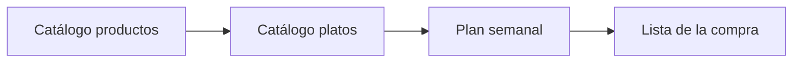
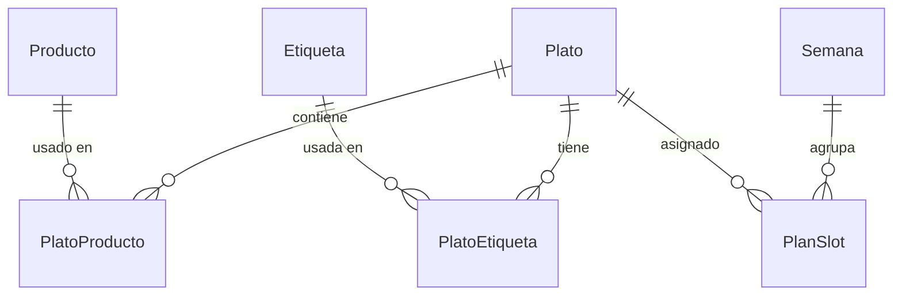

# Howto — Comi2

Guía completa del proyecto: producto, estructura, desarrollo, base de datos y uso de la aplicación.

---

## Índice

1. [Qué es Comi2](#qué-es-comi2)
2. [Glosario](#glosario)
3. [Decisiones de producto](#decisiones-de-producto)
4. [Estructura del repositorio](#estructura-del-repositorio)
5. [Stack técnico](#stack-técnico)
6. [Arranque y scripts](#arranque-y-scripts)
7. [Uso de la aplicación](#uso-de-la-aplicación)
8. [Pantallas y rutas](#pantallas-y-rutas)
9. [Etiquetas con color](#etiquetas-con-color)
10. [Base de datos (Dexie / IndexedDB)](#base-de-datos-dexie--indexeddb)
11. [Código fuente (`app/src/`)](#código-fuente-appsrc)
12. [Flujos de usuario](#flujos-de-usuario)
13. [Requisitos (resumen)](#requisitos-resumen)
14. [Funcionalidades futuras](#funcionalidades-futuras)
15. [APK Android (Capacitor)](#apk-android-capacitor)
16. [Documentación adicional](#documentación-adicional)
17. [Assets de diseño](#assets-de-diseño)
18. [Enlaces útiles](#enlaces-útiles)

---

## Qué es Comi2

**Comi2** ayuda a **planificar las comidas de la semana** y a **generar la lista de la compra** a partir de los platos elegidos.

El usuario:

1. Mantiene un catálogo de **productos** (ingredientes).
2. Define **platos** con los productos necesarios, un **momento** (comida / cena / ambos) y **etiquetas** con color.
3. Asigna platos a los huecos de **comida** y **cena** de cada día (lunes a domingo).
4. Genera una **lista de la compra** con los productos únicos de esa semana (sin cantidades en el MVP).



**Supuestos:** un usuario por navegador, datos solo en local, sin servidor ni sincronización entre dispositivos.

---

## Glosario

| Término | Definición |
|---------|------------|
| **Producto** | Ingrediente o artículo de compra; tiene **nombre** y **emoji** (icono visual) |
| **Plato** | Comida preparada, compuesta por uno o más productos |
| **Momento del plato** | `comida`, `cena` o `ambos` — define en qué huecos del planificador puede asignarse |
| **Etiqueta** | Etiqueta libre con **nombre** y **color**; se gestiona al editar un plato; varias por plato |
| **Comida** | Almuerzo en el plan semanal |
| **Cena** | Cena en el plan semanal |
| **Plan semanal** | Asignaciones plato ↔ día ↔ (comida \| cena) para una semana |
| **Lista de la compra** | Productos únicos derivados del plan activo |

---

## Decisiones de producto

| Tema | Decisión |
|------|----------|
| Huecos por día | Un plato por **comida** y uno por **cena** (14 huecos/semana) |
| Inicio de semana | **Lunes** |
| Cantidades | Solo nombres en la lista; **sin cantidades** ni unidades en el MVP |
| Momento del plato | Solo comida / solo cena / ambos; el planificador filtra platos compatibles |
| Etiquetas | Varias por plato; CRUD al **editar el plato**; cada etiqueta con **color**; catálogo reutilizable |
| Semana activa | Semana del calendario actual (lunes de la semana en curso) |

---

## Estructura del repositorio

```
Comi2/
├── README.md
├── package.json           # Atajos npm (delegan en app/): dev, build, lint, preview
├── howto-comi2.md          # Este documento
├── releases/               # APK comi2.apk local tras build (patrón *.apk en .gitignore)
├── .gitignore
├── docs/                   # Documentación de producto (español)
│   ├── README.md
│   ├── requisitos/requisitos.md
│   ├── funcionalidades/funcionalidades.md
│   ├── arquitectura/arquitectura.md
│   └── guias/
│       ├── desarrollo.md
│       └── android-apk.md   # Guía completa APK
├── assets/                 # Diseños e imágenes (no código)
│   ├── README.md
│   ├── disenos/
│   └── imagenes/
└── app/                    # Aplicación React + Capacitor
    ├── package.json
    ├── capacitor.config.ts
    ├── vite.config.ts
    ├── index.html
    ├── scripts/            # Atajos build (p. ej. build-apk-debug.ps1)
    ├── android/            # Proyecto Gradle (APK)
    └── src/
```

**Convención:** `docs/` y `assets/` en la raíz; todo el código y dependencias npm viven en **`app/`**. En la raíz hay un `package.json` mínimo para quien prefiera ejecutar `npm run dev` sin hacer `cd app` cada vez (tras `npm install` una vez dentro de `app/`).

**Android:** la carpeta `app/android/` forma parte del repo; **no es necesaria** para desarrollo web ni para `npm run dev`. Quien no vaya a generar APK puede ignorar JDK, SDK y la guía [android-apk.md](docs/guias/android-apk.md).

---

## Stack técnico

| Capa | Tecnología |
|------|------------|
| UI | React 19 + TypeScript |
| Enrutado | React Router |
| Build | Vite |
| BD local | Dexie.js → IndexedDB (`comi2-db`) |
| Estilos | CSS en `app/src/styles/index.css` |
| Reactividad datos | `dexie-react-hooks` (`useLiveQuery`) |
| APK Android | Capacitor 8 — WebView, `appId` `es.comi2.app` |

---

## Arranque y scripts

### Solo navegador (recomendado para empezar)

No necesitas Android Studio ni JDK para trabajar en Comi2: la app es una SPA que corre en el navegador con Vite.

### Requisitos previos

- Node.js LTS (v20+ recomendado)
- npm

### Instalar dependencias (una vez)

Las dependencias están en **`app/`**:

```bash
cd app
npm install
```

### Desarrollo

Desde **`app/`**:

```bash
npm run dev
```

También puedes arrancar desde la **raíz del repositorio** (usa `npm --prefix app run dev`):

```bash
npm run dev
```

Abre la URL de Vite (por defecto `http://localhost:5173`).

### Scripts en la raíz del repo (`package.json`)

| Comando | Descripción |
|---------|-------------|
| `npm run dev` | Igual que `npm run dev` en `app/` |
| `npm run build` | Build de producción en `app/` |
| `npm run lint` | ESLint en `app/` |
| `npm run preview` | Vista previa del build en `app/` |

Los scripts **`cap:*`** y la APK siguen documentados solo en **`app/package.json`** y en [docs/guias/android-apk.md](docs/guias/android-apk.md); ejecutarlos siempre desde **`cd app`**.

### Scripts (`app/`)

| Comando | Descripción |
|---------|-------------|
| `npm run dev` | Servidor de desarrollo con HMR |
| `npm run build` | Compilación de producción (`dist/`) |
| `npm run preview` | Vista previa del build |
| `npm run lint` | ESLint |
| `npm run cap:sync` | Build + `cap sync` (web → Android); solo si trabajas con APK |
| `npm run cap:android` | Abre Android Studio |
| `npm run cap:apk:debug` | APK de prueba → `releases/comi2.apk` |
| `npm run cap:apk:release` | Build release (firma / keystore) |
| `npm run cap:apk:debug:unix` | APK debug en Linux/macOS |
| `npm run cap:icons` | Icono APK = favicon (`@capacitor/assets`) |

### Inspeccionar la base de datos

DevTools → **Application** → **IndexedDB** → `comi2-db` → tablas.

### Dependencias principales

- `dexie`, `dexie-react-hooks`
- `react-router-dom`

---

## Uso de la aplicación

### Primer uso (paso a paso)

1. **Platos → Nuevo plato** — Nombre, momento (comida/cena/ambos), productos del plato, etiquetas con color. (Puedes crear productos al vuelo desde la edición del plato.)
2. **Productos** — Opcional: revisa o amplía el catálogo de ingredientes.
3. **Semana** — Asigna un plato a cada comida y cena de lunes a domingo. **Limpiar semana** borra todas las asignaciones de la semana activa (pide confirmación).
4. **Lista** — Pulsa **Generar lista** y marca con el checkbox los productos que **ya tienes en casa** para quitarlos de la compra. **Borrar lista** deja la pantalla como al inicio.

### Reglas importantes

- No puedes eliminar un **producto** si está en algún plato.
- En **Semana**, solo aparecen platos cuyo **momento** encaja con el hueco (un plato `cena` no sale al planificar comida).
- La **lista** se recalcula al pulsar **Generar lista**. Mientras navegas por la app, la última lista generada y tus marcas «ya en casa» **se conservan** hasta que vuelvas a generar, borres la lista o recargues la página por completo.
- Si cambias el plan en **Semana**, conviene **Generar lista** otra vez para alinear la compra con el menú actual (la lista anterior puede quedar desfasada hasta que lo hagas).
- Editar el **nombre o color** de una etiqueta en el catálogo afecta a **todos** los platos que la usan.

---

## Pantallas y rutas

| Ruta | Pantalla | Qué hace |
|------|----------|----------|
| `/` | — | Redirige a `/platos` |
| `/productos` | Productos | Alta, listado (con emoji) y eliminación |
| `/productos/:id` | Detalle del producto | Editar nombre (lápiz inline), emoji y ver platos |
| `/platos` | Platos | Catálogo agrupado (ver abajo); al final, **Respaldo** exportar/importar JSON |
| `/platos/nuevo` | Nuevo plato | Formulario de alta |
| `/platos/:id` | Detalle del plato | Información del plato; botón **Editar plato** → `/platos/:id/editar` |
| `/platos/:id/editar` | Editar plato | Modificar nombre, momento, productos y etiquetas |
| `/semana` | Semana | Planificador 7 días × (comida, cena); **Limpiar semana** si hay platos asignados |
| `/lista` | Lista de la compra | **Generar lista** / **Borrar lista**; la lista persiste al cambiar de ruta en la misma sesión; checkbox «ya lo tengo»; «Ya en casa» |

Navegación (orden en menú): **Platos · Productos · Semana · Lista**. La ruta `/` redirige a `/platos`.

### Marca en cabecera y favicon

| Elemento | Archivo fuente | En la app (`app/public/`) |
|----------|----------------|---------------------------|
| Wordmark «Comi2» | `assets/imagenes/logo2.svg` | `logo-mark.svg` (fuente) |
| Icono (cuchara / marca) | `assets/imagenes/comi2.svg` | `brand-icon.svg` (fuente) |
| Cabecera (marca) | `logo2.svg` + `comi2.svg` recortados | `logo-mark.svg` + `brand-icon.svg` |
| Favicon y PWA | `assets/imagenes/favicon.svg` (recorte de `logo2`) | `favicon.svg`, `icon-512.png`, `manifest.webmanifest` |

La **cabecera** muestra **logo-mark** + **brand-icon** (dos SVG recortados, sin solapar). Centrada en la barra con fondo verde pastel (`--color-header-bg`). Títulos de página en verde oscuro (`--color-sage-deep` / `--color-header-title`). Menú inferior en móvil con iconos Phosphor en verde oscuro cuando la ruta está activa.

Al cambiar los SVG en `assets/imagenes/`:

- En `app/`: `npm run brand:sync` → genera `logo-mark.svg` y `brand-icon.svg` (trazos separados en x=402, uno al lado del otro en la cabecera).
- Regenera `favicon.svg` si cambia el dibujo (ver `assets/imagenes/favicon.svg`).
- `logo2.png` → `apple-touch-icon.png` e `icon-512.png` (opcional, para iOS / PWA).

### Pantalla Platos — vistas y subsecciones

En `/platos` hay tres pestañas en dos filas (**Todos** a ancho completo; debajo **Por momento** y **Por etiquetas**):

| Pestaña | Agrupación |
|---------|------------|
| **Todos** | Listado completo visible al instante (orden alfabético, sin acordeón) |
| **Por momento** | Subsecciones: Comida, Cena, Comida y cena |
| **Por etiquetas** | Una subsección por cada etiqueta del catálogo + **Sin etiquetas** si aplica |

En **Por momento** y **Por etiquetas**, cada subsección es un **acordeón cerrado por defecto** con **tinte de color** (comida/cena/ambos o color de la etiqueta). En **Todos** la lista se muestra directamente. En la vista por momento no se repite la pastilla de momento en cada tarjeta.

### Respaldo JSON (final de la página Platos)

Al pie de **Platos** (visible también si el catálogo está vacío, tras cargar la página):

| Acción | Qué hace |
|--------|----------|
| **Exportar respaldo** | Descarga `comi2-respaldo-AAAA-MM-DD.json` con `format: "comi2-backup"` y `version: 1`. Incluye en `data`: `productos`, `platos`, `etiquetas`, `platoProductos`, `platoEtiquetas`, `semanas`, `planSlots` (ids preservados para mantener coherencia). |
| **Importar respaldo** | Tras confirmación, **reemplaza por completo** esas tablas en IndexedDB y vacía la lista de la compra en memoria de la sesión. Valida el formato, referencias entre tablas e ids duplicados. |

Útil para **copia de seguridad**, cambiar de navegador o llevar datos a otra instalación (web o APK) **con la misma versión de formato de respaldo**.

### Pantalla Productos — detalle (`/productos/:id`)

1. Pulsa un producto en el listado.
2. **Emoji:** pulsa el emoji para abrir el selector (cuadrícula con varias filas y **buscador** por nombre en español, p. ej. «tomate», «leche»).
3. **Nombre:** pulsa el **lápiz**, edita en línea; Enter o salir del campo guarda; Escape cancela.
4. Debajo, los **platos** que usan ese ingrediente.

---

## Etiquetas con color

Gestionadas en la pantalla **Editar plato** (`/platos/nuevo` o `/platos/:id/editar`).

### Asignar al plato (inline)

- **Chips asignados** — Muestran etiquetas del plato; **×** las quita del plato (no borra del catálogo).
- **Sin etiquetas** — Si el plato aún no tiene ninguna, se muestra un chip **deshabilitado** con el texto «Sin etiquetas».
- **Añadir existente** — Clic en un chip disponible para asignarlo directamente en el formulario.

### Gestionar etiquetas (modal)

El botón **Gestionar etiquetas** abre un modal dedicado con dos secciones:

- **Nueva etiqueta** — Nombre + color (selector nativo o paleta de colores) → **Crear y asignar**. La etiqueta creada queda asignada al plato al instante.
- **Catálogo** — Lista de todas las etiquetas con dos acciones por fila:
  - **Editar** — Abre un sub-modal para cambiar nombre y color (aplica a todos los platos).
  - **Eliminar** — Borra la etiqueta y la desvincula de todos los platos.

El modal se cierra con el botón **Cerrar**, pulsando fuera o con **Escape** (si hay un sub-modal de edición abierto, Escape cierra ese primero).

### Visualización

Componente `TagChip`: fondo con el color de la etiqueta y texto con contraste automático (claro/oscuro según luminancia). Variante `disabled` para el estado «Sin etiquetas».

---

## Base de datos (Dexie / IndexedDB)

**Nombre:** `comi2-db`  
**Definición:** [`app/src/db/database.ts`](app/src/db/database.ts)  
**Tipos:** [`app/src/db/types.ts`](app/src/db/types.ts)

### Migraciones

| Versión | Contenido |
|---------|-----------|
| 1 | Tabla `items` (prueba inicial; obsoleta) |
| 2 | Modelo de dominio completo |
| 3 | Campo `emoji` en `productos` (migración asigna emoji a registros existentes) |

### Tablas (v3)

| Tabla | Campos principales | Descripción |
|-------|-------------------|-------------|
| `productos` | `id`, `nombre`, `emoji` | Ingredientes con emoji visual |
| `platos` | `id`, `nombre`, `momento` | Platos (`momento`: comida \| cena \| ambos) |
| `etiquetas` | `id`, `nombre`, `color` | Etiquetas (nombre único, color hex) |
| `platoProductos` | `platoId`, `productoId` | Productos de cada plato |
| `platoEtiquetas` | `platoId`, `etiquetaId` | Etiquetas de cada plato |
| `semanas` | `id`, `fechaInicioLunes` | Semana (lunes de referencia) |
| `planSlots` | `semanaId`, `diaSemana`, `momento`, `platoId?` | Un plato por hueco (0=lunes … 6=domingo) |

### Diagrama entidad-relación



### Generar lista de la compra (algoritmo)

Implementado en [`app/src/lib/lista.ts`](app/src/lib/lista.ts):

1. Obtener `planSlots` de la semana actual con `platoId` definido.
2. Recoger todos los `productoId` de esos platos vía `platoProductos`.
3. Unir en un conjunto (cada producto **una sola vez**).
4. Ordenar por nombre y mostrar.

La lista **no se guarda** en IndexedDB; se calcula al pulsar **Generar lista**. Los productos marcados «ya en casa» y la última lista generada **persisten en memoria** durante la sesión de la app (contexto React), de modo que al cambiar de sección no se pierden hasta regenerar, borrar la lista o recargar la página.

### Semana actual

[`app/src/lib/semana.ts`](app/src/lib/semana.ts) calcula el lunes de la semana en curso. Si no existe registro en `semanas`, se crea al abrir **Semana**.

---

## Código fuente (`app/src/`)

```
app/src/
├── main.tsx                 # Punto de entrada
├── App.tsx                  # Rutas React Router + ListaCompraProvider
├── context/
│   ├── listaCompraContext.ts
│   ├── ListaCompraProvider.tsx
│   └── useListaCompra.ts    # Lista de compra en sesión (entre rutas)
├── db/
│   ├── database.ts          # Comi2Database (Dexie)
│   └── types.ts             # Tipos de dominio
├── lib/
│   ├── backup.ts            # Exportar / importar respaldo JSON (formato versionado)
│   ├── color.ts             # Hex, contraste, paleta de etiquetas
│   ├── platos.ts            # Guardar plato, etiquetas, sincronizar relaciones
│   ├── productos.ts         # CRUD producto, platos por producto
│   ├── producto-emoji.ts    # Catálogo de emojis, búsqueda por keywords ES, valor por defecto
│   ├── lista.ts             # generarListaCompra()
│   ├── momento-icons.tsx    # Iconos sol/luna para comida y cena
│   └── semana.ts            # Semana activa, normalización de fechas, asignarPlatoEnSlot
├── components/
│   ├── Layout.tsx           # Cabecera (logo2 + comi2), nav escritorio/móvil
│   ├── PageHeader.tsx       # Título de página con icono
│   ├── PlatosBackupPanel.tsx # UI exportar / importar respaldo en Platos
│   ├── EmptyState.tsx       # Estados vacíos con ilustración
│   ├── TagChip.tsx          # Chip de etiqueta con color
│   ├── MomentoBadge.tsx     # Pastilla comida/cena/ambos
│   ├── ProductoEmoji.tsx    # Muestra emoji de producto
│   ├── ProductoEmojiPicker.tsx # Panel con buscador y rejilla 8×N
│   ├── ProductoInlineTitle.tsx # Nombre editable + selector emoji
│   └── InlineProductoAdd.tsx
├── pages/
│   ├── ProductosPage.tsx
│   ├── ProductoPlatosPage.tsx
│   ├── PlatosPage.tsx
│   ├── PlatoDetailPage.tsx
│   ├── PlatoEditPage.tsx
│   ├── SemanaPage.tsx
│   └── ListaPage.tsx
└── styles/
    └── index.css
```

### Lógica destacada

| Archivo | Responsabilidad |
|---------|-----------------|
| `lib/platos.ts` | `guardarPlato`, `crearEtiqueta`, `actualizarEtiqueta`, `eliminarEtiqueta`, sync de productos/etiquetas |
| `lib/backup.ts` | Formato `comi2-backup` v1; validación; exportación / restauración transaccional |
| `ProductoPlatosPage.tsx` | Detalle: emoji, nombre inline, platos que lo usan |
| `PlatosPage.tsx` | Pestañas (Todos ancho completo); acordeones con color; panel **Respaldo** |
| `PlatosBackupPanel.tsx` | UI para exportar / importar JSON |
| `PlatoDetailPage.tsx` | Vista de un plato (momento, etiquetas, ingredientes); enlace a editar |
| `PlatoEditPage.tsx` | Alta (`/nuevo`) y edición (`/:id/editar`); recibe `state.desdeSemana` para asignar plato al volver; modal **Gestionar etiquetas** |
| `SemanaPage.tsx` | Grilla semanal; iconos sol/luna; **Limpiar semana**; **Ver resumen** (modal); **«+ Nuevo plato…»** en desplegables |
| `ListaPage.tsx` | Generar / borrar lista; estado global en sesión; checkbox «ya en casa» |

---

## Flujos de usuario

### A — Configurar un plato

1. Ir a **Platos** → **Nuevo plato**, o elegir **«+ Nuevo plato…»** en cualquier hueco de la semana.
2. Nombre y **momento** (comida / cena / ambos; si vienes desde un hueco, ya viene preseleccionado).
3. Asignar **etiquetas** existentes (chips clicables) o pulsar **Gestionar etiquetas** para crear nuevas o editar/eliminar el catálogo.
4. Añadir **productos**: marcar en «Añadir del catálogo», crear con **Añadir producto al catálogo**, o quitar con × en «En este plato».
5. **Guardar**:
   - Si venías desde **Semana**, el plato se asigna automáticamente en el hueco elegido y regresas al planificador.
   - En caso contrario, abres la **vista del plato** con mensaje de confirmación; desde ahí puedes **Editar** de nuevo.

### A2 — Consultar el catálogo de platos

1. Ir a **Platos**.
2. Elige **Todos**, **Por momento** o **Por etiquetas**.
3. Abre la subsección que te interese y pulsa un plato para ver su **ficha** (momento, etiquetas, ingredientes).
4. Desde la ficha, **Editar plato** abre el formulario de cambios.

### A3 — Copia de seguridad o migrar datos

1. Ir a **Platos** y bajar hasta **Respaldo**.
2. **Exportar respaldo** para descargar el JSON.
3. En otro navegador o instalación de Comi2: **Importar respaldo**, elegir el archivo y confirmar (se sustituyen todos los datos locales de ese perfil).

### B — Planificar la semana

1. Ir a **Semana**.
2. En cada día, elegir plato de **Comida** y de **Cena** (desplegable).
   - Si no existe el plato, elegir **«+ Nuevo plato…»** al final de la lista: se abre el formulario de creación con el momento preseleccionado; al guardar el plato queda asignado en ese hueco y se regresa a Semana.
3. Los cambios se guardan al instante en IndexedDB.
4. Pulsar **Ver resumen** para consultar los 7 días con sus platos en un modal de solo lectura (se cierra con el botón Cerrar, clic fuera o Escape).
5. Opcional: **Limpiar semana** vacía todos los huecos (confirmación).

### C — Hacer la compra

1. Ir a **Lista** → **Generar lista**.
2. Cada fila muestra **checkbox · emoji · nombre** alineados a la izquierda.
3. Marca con el checkbox los productos que **ya tienes**; desaparecen de la lista principal.
4. Si te equivocas, ábrelos en **Ya en casa** (misma fila con emoji y nombre) y desmarca para volver a añadirlos.
5. Puedes ir a otras secciones y volver: la lista y las marcas **siguen en la misma sesión del navegador** hasta que pulses **Generar lista** de nuevo, **Borrar lista** o recargues la página.
6. Si cambias el plan en **Semana**, vuelve a **Generar lista** para actualizar la compra.

---

## Requisitos (resumen)

### Funcionales (implementados en MVP)

| ID | Descripción |
|----|-------------|
| RF-001 | CRUD productos |
| RF-002 | CRUD platos con momento comida/cena/ambos |
| RF-003 | Productos por plato (sin cantidades) |
| RF-009 | Etiquetas con color, gestión al editar plato |
| RF-004 | Plan semanal lunes–domingo, 14 huecos |
| RF-005 | Lista de compra (productos únicos) |
| RF-006 | Checkbox «Ya lo tengo» en la lista de la compra |
| RF-010 | Emoji por producto; edición inline del nombre en detalle |
| RF-011 | Detalle producto: platos que usan el ingrediente |
| RF-012 | Listado platos: pestañas Todos / momento / etiquetas con acordeones |
| RF-013 | Respaldo JSON: exportar / importar datos (productos, platos, etiquetas, semana) |

### Pendientes / futuro

| ID | Descripción |
|----|-------------|
| RF-007 | Copiar semana anterior |
| RF-008 | Categorías de productos |

### No funcionales

- Sin servidor (IndexedDB)
- Interfaz en español
- Datos persistentes en el navegador
- Diseño responsive básico

Detalle completo: [docs/requisitos/requisitos.md](docs/requisitos/requisitos.md).

---

## Funcionalidades futuras

| Feature | Prioridad |
|---------|-----------|
| Persistir «ya en casa» entre sesiones | Baja |
| Cantidades y unidades en productos / lista | Media |
| Filtrar platos por etiqueta en Semana | Media |
| Copiar semana anterior | Baja |
| Categorías de productos en la lista | Baja |
| Desayuno u otras comidas | Baja |
| Exportar lista (PDF / texto) | Baja |
| Varias semanas / historial | Baja |

Detalle: [docs/funcionalidades/funcionalidades.md](docs/funcionalidades/funcionalidades.md).

---

## APK Android (Capacitor) — opcional

**Quien solo quiera ejecutar Comi2 en el ordenador no necesita este apartado:** basta con Node, `npm install` en `app/` y `npm run dev` (o el atajo desde la raíz del repo). La APK es para instalar la misma interfaz en un dispositivo Android; implica **JDK 21**, **Android SDK** y los pasos de [docs/guias/android-apk.md](docs/guias/android-apk.md).

La misma app web se empaqueta como **APK** para Android. Los datos siguen en **IndexedDB** en el dispositivo (sin servidor).

### Requisitos

- Node.js LTS (v20+)
- **JDK 21** (Capacitor 8; en Windows suele usarse el JBR de Android Studio)
- **Android SDK** — p. ej. con [Android Studio](https://developer.android.com/studio)
- Archivo local **`app/android/local.properties`** con `sdk.dir` (plantilla: `app/android/local.properties.example`)

### Comando rápido

```bash
cd app
npm install
# Primera vez: copiar local.properties.example → local.properties y ajustar sdk.dir
npm run cap:apk:debug
```

**Salida:** `releases/comi2.apk` (raíz del repo)

### Qué hace el flujo

1. `npm run build` — genera `app/dist/`
2. `cap sync` — copia assets y config a `app/android/`
3. Gradle `assembleDebug` — compila la APK

### Cambios clave en el código (ya en el repo)

| Archivo | Cambio |
|---------|--------|
| `app/capacitor.config.ts` | `appId`, `webDir: 'dist'`, `androidScheme: 'https'` |
| `app/vite.config.ts` | `base: './'` (rutas relativas en WebView) |
| `app/index.html` | `viewport-fit=cover` |
| `app/package.json` | Dependencias `@capacitor/*` y scripts `cap:*` |
| `app/android/` | Proyecto nativo generado por Capacitor |
| `app/assets/icon.svg` | Favicon → iconos launcher (`npm run cap:icons`) |

### Documentación completa

Todos los pasos desde cero, instalación en el móvil, release firmado y errores frecuentes:

**[docs/guias/android-apk.md](docs/guias/android-apk.md)**

---

## Documentación adicional

| Documento | Contenido |
|-----------|-----------|
| [docs/README.md](docs/README.md) | Índice de documentación |
| [docs/requisitos/requisitos.md](docs/requisitos/requisitos.md) | Requisitos funcionales y no funcionales |
| [docs/funcionalidades/funcionalidades.md](docs/funcionalidades/funcionalidades.md) | Módulos, criterios de aceptación, flujos |
| [docs/arquitectura/arquitectura.md](docs/arquitectura/arquitectura.md) | Capas, modelo de datos, decisiones técnicas |
| [docs/branding/branding.md](docs/branding/branding.md) | Branding: pasteles, fuentes modernas, iconos, botones |
| [docs/guias/desarrollo.md](docs/guias/desarrollo.md) | Guía breve para desarrolladores |
| [docs/guias/android-apk.md](docs/guias/android-apk.md) | APK Android: Capacitor, Gradle, JDK 21, troubleshooting |
| [README.md](README.md) | Resumen del repo y enlace a este howto |

---

## Assets de diseño

Recursos visuales fuera del código:

| Carpeta | Uso |
|---------|-----|
| `assets/disenos/` | Mockups, wireframes, exports Figma |
| `assets/imagenes/` | Logos (`logo2.svg`, `comi2.svg`, `favicon.svg`), PNG auxiliares |

Convenciones de nombres: [assets/README.md](assets/README.md) (kebab-case, versiones en el nombre del archivo).

**Producción:** los archivos servidos por Vite están en `app/public/` (`favicon.svg`, `logo-mark.svg`, `brand-icon.svg`, `manifest.webmanifest`). Mantener sincronizados con `assets/imagenes/` tras cambiar la marca.

---

## Enlaces útiles

- [README del proyecto](README.md)
- [Dexie.js](https://dexie.org/)
- [Vite](https://vite.dev/)
- [React](https://react.dev/)
- [React Router](https://reactrouter.com/)
- [Capacitor](https://capacitorjs.com/)
