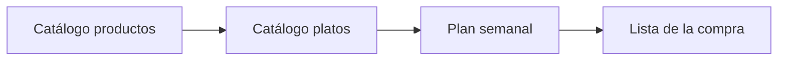
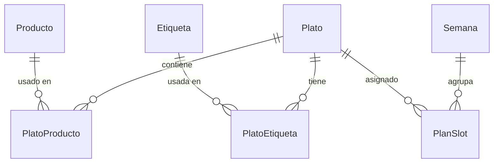

# Howto — Comi2

Guía completa del proyecto: producto, estructura, desarrollo, base de datos y uso de la aplicación.

---

## Índice

1. [Qué es Comi2](#qué-es-comi2)
2. [Glosario](#glosario)
3. [Decisiones de producto](#decisiones-de-producto)
4. [Estructura del repositorio](#estructura-del-repositorio)
5. [Stack técnico](#stack-técnico)
6. [Arranque y scripts](#arranque-y-scripts)
7. [Uso de la aplicación](#uso-de-la-aplicación)
8. [Pantallas y rutas](#pantallas-y-rutas)
9. [Etiquetas con color](#etiquetas-con-color)
10. [Base de datos (Dexie / IndexedDB)](#base-de-datos-dexie--indexeddb)
11. [Código fuente (`app/src/`)](#código-fuente-appsrc)
12. [Flujos de usuario](#flujos-de-usuario)
13. [Requisitos (resumen)](#requisitos-resumen)
14. [Funcionalidades futuras](#funcionalidades-futuras)
15. [Documentación adicional](#documentación-adicional)
16. [Assets de diseño](#assets-de-diseño)
17. [Enlaces útiles](#enlaces-útiles)

---

## Qué es Comi2

**Comi2** ayuda a **planificar las comidas de la semana** y a **generar la lista de la compra** a partir de los platos elegidos.

El usuario:

1. Mantiene un catálogo de **productos** (ingredientes).
2. Define **platos** con los productos necesarios, un **momento** (comida / cena / ambos) y **etiquetas** con color.
3. Asigna platos a los huecos de **comida** y **cena** de cada día (lunes a domingo).
4. Genera una **lista de la compra** con los productos únicos de esa semana (sin cantidades en el MVP).



**Supuestos:** un usuario por navegador, datos solo en local, sin servidor ni sincronización entre dispositivos.

---

## Glosario

| Término | Definición |
|---------|------------|
| **Producto** | Ingrediente o artículo de compra (ej. arroz, pollo, aceite) |
| **Plato** | Comida preparada, compuesta por uno o más productos |
| **Momento del plato** | `comida`, `cena` o `ambos` — define en qué huecos del planificador puede asignarse |
| **Etiqueta** | Etiqueta libre con **nombre** y **color**; se gestiona al editar un plato; varias por plato |
| **Comida** | Almuerzo en el plan semanal |
| **Cena** | Cena en el plan semanal |
| **Plan semanal** | Asignaciones plato ↔ día ↔ (comida \| cena) para una semana |
| **Lista de la compra** | Productos únicos derivados del plan activo |

---

## Decisiones de producto

| Tema | Decisión |
|------|----------|
| Huecos por día | Un plato por **comida** y uno por **cena** (14 huecos/semana) |
| Inicio de semana | **Lunes** |
| Cantidades | Solo nombres en la lista; **sin cantidades** ni unidades en el MVP |
| Momento del plato | Solo comida / solo cena / ambos; el planificador filtra platos compatibles |
| Etiquetas | Varias por plato; CRUD al **editar el plato**; cada etiqueta con **color**; catálogo reutilizable |
| Semana activa | Semana del calendario actual (lunes de la semana en curso) |

---

## Estructura del repositorio

```
Comi2/
├── README.md
├── howto-comi2.md          # Este documento
├── .gitignore
├── docs/                   # Documentación de producto (español)
│   ├── README.md
│   ├── requisitos/requisitos.md
│   ├── funcionalidades/funcionalidades.md
│   ├── arquitectura/arquitectura.md
│   └── guias/desarrollo.md
├── assets/                 # Diseños e imágenes (no código)
│   ├── README.md
│   ├── disenos/
│   └── imagenes/
└── app/                    # Aplicación React
    ├── package.json
    ├── vite.config.ts
    ├── index.html
    └── src/
```

**Convención:** `docs/` y `assets/` en la raíz; todo el código y `npm` viven en `app/`.

---

## Stack técnico

| Capa | Tecnología |
|------|------------|
| UI | React 19 + TypeScript |
| Enrutado | React Router |
| Build | Vite |
| BD local | Dexie.js → IndexedDB (`comi2-db`) |
| Estilos | CSS en `app/src/styles/index.css` |
| Reactividad datos | `dexie-react-hooks` (`useLiveQuery`) |

---

## Arranque y scripts

### Requisitos previos

- Node.js LTS (v20+ recomendado)
- npm

### Desarrollo

```bash
cd app
npm install
npm run dev
```

Abre la URL de Vite (por defecto `http://localhost:5173`).

### Scripts (`app/`)

| Comando | Descripción |
|---------|-------------|
| `npm run dev` | Servidor de desarrollo con HMR |
| `npm run build` | Compilación de producción (`dist/`) |
| `npm run preview` | Vista previa del build |
| `npm run lint` | ESLint |

### Inspeccionar la base de datos

DevTools → **Application** → **IndexedDB** → `comi2-db` → tablas.

### Dependencias principales

- `dexie`, `dexie-react-hooks`
- `react-router-dom`

---

## Uso de la aplicación

### Primer uso (paso a paso)

1. **Platos → Nuevo plato** — Nombre, momento (comida/cena/ambos), productos del plato, etiquetas con color. (Puedes crear productos al vuelo desde la edición del plato.)
2. **Productos** — Opcional: revisa o amplía el catálogo de ingredientes.
3. **Semana** — Asigna un plato a cada comida y cena de lunes a domingo.
4. **Lista** — Pulsa **Generar lista** para ver los productos únicos a comprar.

### Reglas importantes

- No puedes eliminar un **producto** si está en algún plato.
- En **Semana**, solo aparecen platos cuyo **momento** encaja con el hueco (un plato `cena` no sale al planificar comida).
- La **lista** se recalcula al pulsar el botón; si cambias el plan, vuelve a generar.
- Editar el **nombre o color** de una etiqueta en el catálogo afecta a **todos** los platos que la usan.

---

## Pantallas y rutas

| Ruta | Pantalla | Qué hace |
|------|----------|----------|
| `/` | — | Redirige a `/platos` |
| `/productos` | Productos | Alta, listado y eliminación de productos |
| `/platos` | Platos | Catálogo agrupado (ver abajo) |
| `/platos/nuevo` | Editar plato | Crear plato (`:id` = `nuevo`) |
| `/platos/:id` | Editar plato | Modificar plato, productos y etiquetas |
| `/semana` | Semana | Planificador 7 días × (comida, cena) |
| `/lista` | Lista de la compra | Generar lista desde la semana actual |

Navegación (orden en menú): **Platos · Productos · Semana · Lista**. La ruta `/` redirige a `/platos`.

### Pantalla Platos — vistas y subsecciones

En `/platos` hay dos pestañas:

| Pestaña | Agrupación |
|---------|------------|
| **Por momento** | Subsecciones: Comida, Cena, Comida y cena |
| **Por etiquetas** | Una subsección por cada etiqueta del catálogo + **Sin etiquetas** si aplica |

Cada subsección es un **acordeón cerrado por defecto**: el título muestra el nombre (o el chip de la etiqueta) y el **número de platos**; al pulsarla se despliega la lista de tarjetas. Un plato con varias etiquetas aparece en varias subsecciones en la vista por etiquetas.

En la vista por momento no se repite la pastilla de momento en cada tarjeta (ya está en el título de la subsección).

---

## Etiquetas con color

Gestionadas en la pantalla **Editar plato** (`/platos/nuevo` o `/platos/:id`).

### Asignar al plato

- **Chips asignados** — Muestran etiquetas del plato; **×** las quita del plato (no borra del catálogo).
- **Añadir existente** — Clic en un chip disponible para asignarlo.
- **Nueva etiqueta** — Nombre + color (selector nativo o paleta de colores) → **Crear y asignar**.

### Catálogo global

Sección desplegable **Catálogo de etiquetas (editar o eliminar)**:

- **Editar** — Modal para cambiar nombre y color (aplica a todos los platos).
- **Eliminar** — Borra la etiqueta y la desvincula de todos los platos.

### Visualización

Componente `TagChip`: fondo con el color de la etiqueta y texto con contraste automático (claro/oscuro según luminancia).

---

## Base de datos (Dexie / IndexedDB)

**Nombre:** `comi2-db`  
**Definición:** [`app/src/db/database.ts`](app/src/db/database.ts)  
**Tipos:** [`app/src/db/types.ts`](app/src/db/types.ts)

### Migraciones

| Versión | Contenido |
|---------|-----------|
| 1 | Tabla `items` (prueba inicial; obsoleta) |
| 2 | Modelo de dominio completo |

### Tablas (v2)

| Tabla | Campos principales | Descripción |
|-------|-------------------|-------------|
| `productos` | `id`, `nombre` | Ingredientes |
| `platos` | `id`, `nombre`, `momento` | Platos (`momento`: comida \| cena \| ambos) |
| `etiquetas` | `id`, `nombre`, `color` | Etiquetas (nombre único, color hex) |
| `platoProductos` | `platoId`, `productoId` | Productos de cada plato |
| `platoEtiquetas` | `platoId`, `etiquetaId` | Etiquetas de cada plato |
| `semanas` | `id`, `fechaInicioLunes` | Semana (lunes de referencia) |
| `planSlots` | `semanaId`, `diaSemana`, `momento`, `platoId?` | Un plato por hueco (0=lunes … 6=domingo) |

### Diagrama entidad-relación



### Generar lista de la compra (algoritmo)

Implementado en [`app/src/lib/lista.ts`](app/src/lib/lista.ts):

1. Obtener `planSlots` de la semana actual con `platoId` definido.
2. Recoger todos los `productoId` de esos platos vía `platoProductos`.
3. Unir en un conjunto (cada producto **una sola vez**).
4. Ordenar por nombre y mostrar.

La lista **no se guarda** en IndexedDB; se calcula al pulsar **Generar lista**.

### Semana actual

[`app/src/lib/semana.ts`](app/src/lib/semana.ts) calcula el lunes de la semana en curso. Si no existe registro en `semanas`, se crea al abrir **Semana**.

---

## Código fuente (`app/src/`)

```
app/src/
├── main.tsx                 # Punto de entrada
├── App.tsx                  # Rutas React Router
├── db/
│   ├── database.ts          # Comi2Database (Dexie)
│   └── types.ts             # Tipos de dominio
├── lib/
│   ├── color.ts             # Hex, contraste, paleta de etiquetas
│   ├── platos.ts            # Guardar plato, etiquetas, sincronizar relaciones
│   ├── productos.ts         # crearProducto, reglas de unicidad
│   ├── lista.ts             # generarListaCompra()
│   └── semana.ts            # Semana activa, normalización de fechas
├── components/
│   ├── Layout.tsx           # Cabecera y navegación (Platos primero)
│   ├── TagChip.tsx          # Chip de etiqueta con color
│   └── InlineProductoAdd.tsx # Alta rápida de producto desde edición de plato
├── pages/
│   ├── ProductosPage.tsx
│   ├── PlatosPage.tsx       # Pestañas momento/etiquetas y acordeones
│   ├── PlatoEditPage.tsx    # Edición + etiquetas + productos en el plato
│   ├── SemanaPage.tsx
│   └── ListaPage.tsx
└── styles/
    └── index.css
```

### Lógica destacada

| Archivo | Responsabilidad |
|---------|-----------------|
| `lib/platos.ts` | `guardarPlato`, `crearEtiqueta`, `actualizarEtiqueta`, `eliminarEtiqueta`, sync de productos/etiquetas |
| `PlatosPage.tsx` | Agrupación por momento o etiquetas; subsecciones `<details>` colapsables |
| `PlatoEditPage.tsx` | Formulario del plato; lista «En este plato»; catálogo desplegable; `InlineProductoAdd` (sin `<form>` anidado) |
| `SemanaPage.tsx` | Grilla semanal; filtra platos por `momento` |
| `ListaPage.tsx` | Botón generar + listado de productos |

---

## Flujos de usuario

### A — Configurar un plato

1. Ir a **Platos** → **Nuevo plato**.
2. Nombre y **momento** (comida / cena / ambos).
3. Crear o seleccionar **etiquetas** (con color).
4. Añadir **productos**: marcar en «Añadir del catálogo», crear con **Añadir producto al catálogo**, o quitar con × en «En este plato».
5. **Guardar** (vuelves al listado con mensaje de confirmación).

### A2 — Consultar el catálogo de platos

1. Ir a **Platos**.
2. Elige **Por momento** o **Por etiquetas**.
3. Abre la subsección que te interese para ver sus platos.

### B — Planificar la semana

1. Ir a **Semana**.
2. En cada día, elegir plato de **Comida** y de **Cena** (desplegable).
3. Los cambios se guardan al instante en IndexedDB.

### C — Hacer la compra

1. Ir a **Lista** → **Generar lista**.
2. Revisar productos únicos.
3. Si cambias el plan en **Semana**, vuelve a **Generar lista**.

---

## Requisitos (resumen)

### Funcionales (implementados en MVP)

| ID | Descripción |
|----|-------------|
| RF-001 | CRUD productos |
| RF-002 | CRUD platos con momento comida/cena/ambos |
| RF-003 | Productos por plato (sin cantidades) |
| RF-009 | Etiquetas con color, gestión al editar plato |
| RF-004 | Plan semanal lunes–domingo, 14 huecos |
| RF-005 | Lista de compra (productos únicos) |

### Pendientes / futuro

| ID | Descripción |
|----|-------------|
| RF-006 | Marcar productos comprados en la lista |
| RF-007 | Copiar semana anterior |
| RF-008 | Categorías de productos |

### No funcionales

- Sin servidor (IndexedDB)
- Interfaz en español
- Datos persistentes en el navegador
- Diseño responsive básico

Detalle completo: [docs/requisitos/requisitos.md](docs/requisitos/requisitos.md).

---

## Funcionalidades futuras

| Feature | Prioridad |
|---------|-----------|
| Marcar comprado en la lista | Media |
| Cantidades y unidades en productos / lista | Media |
| Filtrar platos por etiqueta en Semana | Media |
| Copiar semana anterior | Baja |
| Categorías de productos en la lista | Baja |
| Desayuno u otras comidas | Baja |
| Exportar lista (PDF / texto) | Baja |
| Varias semanas / historial | Baja |

Detalle: [docs/funcionalidades/funcionalidades.md](docs/funcionalidades/funcionalidades.md).

---

## Documentación adicional

| Documento | Contenido |
|-----------|-----------|
| [docs/README.md](docs/README.md) | Índice de documentación |
| [docs/requisitos/requisitos.md](docs/requisitos/requisitos.md) | Requisitos funcionales y no funcionales |
| [docs/funcionalidades/funcionalidades.md](docs/funcionalidades/funcionalidades.md) | Módulos, criterios de aceptación, flujos |
| [docs/arquitectura/arquitectura.md](docs/arquitectura/arquitectura.md) | Capas, modelo de datos, decisiones técnicas |
| [docs/branding/branding.md](docs/branding/branding.md) | Branding: pasteles, fuentes modernas, iconos, botones |
| [docs/guias/desarrollo.md](docs/guias/desarrollo.md) | Guía breve para desarrolladores |
| [README.md](README.md) | Resumen del repo y enlace a este howto |

---

## Assets de diseño

Recursos visuales fuera del código:

| Carpeta | Uso |
|---------|-----|
| `assets/disenos/` | Mockups, wireframes, exports Figma |
| `assets/imagenes/` | Iconos, logos, ilustraciones |

Convenciones de nombres: [assets/README.md](assets/README.md) (kebab-case, versiones en el nombre del archivo).

Para assets en producción, copiar o referenciar desde `app/public/` cuando corresponda.

---

## Enlaces útiles

- [README del proyecto](README.md)
- [Dexie.js](https://dexie.org/)
- [Vite](https://vite.dev/)
- [React](https://react.dev/)
- [React Router](https://reactrouter.com/)
